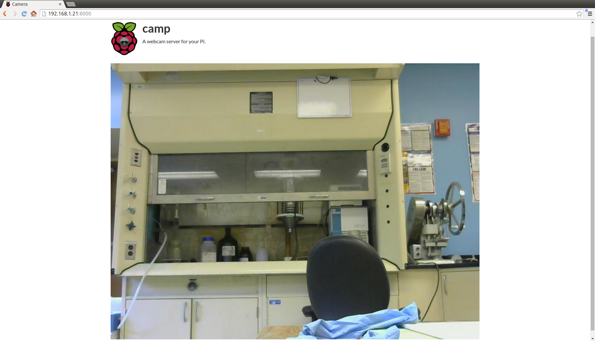

camp
====

Another Raspberry Pi camera webserver.



This project is a fork of `https://github.com/patrickfuller/camp`
developed by Patrick Fuller. The purpose of this fork is to refactor
the code and to standardize installation and password creation into
the web server. Another aim is to improve visualization of camera
video in a mobile phone. Finally, this project introduces SSL
transport for secure connections.

What it does
============

Hosts a website where you can view your webcam in real time.

Why I wrote it
==============

There are a *lot* of tutorials out there on how to turn your pi into a webcam
server. Most of them involve installing [motion](http://www.lavrsen.dk/foswiki/bin/view/Motion),
which works great in many use cases. However, I wanted something simpler. Namely,
I wanted:

 * Minimal configuration
 * Password protection
 * One-way streaming
 * Easily customizable webpage
 * Extensible server

**camp** does just this. Nothing else. This (hopefully) makes it the
simplest and fastest option out there.

Installation
============

Camp uses [tornado](http://www.tornadoweb.org/en/stable/) to create a
web server. It can interact with the [Pi camera](http://www.adafruit.com/products/1367)
with the aptly named [picamera](http://picamera.readthedocs.org/en/release-1.7/)
module, or it can use USB webcams with [opencv](http://opencv.org/)
and [Pillow](http://pillow.readthedocs.org/en/latest/installation.html). The
command below installs all the dependencies and helps you to configure
your WiFi connection. So, start cloning the server (probably through ethernet
connection), and continue executing dependencies installation:

```
$ git clone https://github.com/patrickfuller/camp.git
$ cd camp
$ sudo python install.py
```

Now you can run the server:

```
$ python camp/server.py
```

Navigate to http://your.r.pi.ip:8000 and check out your webcam.

####USB Camera

Use with `python server.py --use-usb`.

####Password


With the `--require-login` flag, camp will open a login page before
allowing webcam access. So, firstly you need to configure a password
to be used during your login:

```
$ python app/server.py --create-password
[sudo] password for pi:
Password: 
Retype password: 
```

This will prompt you for a password, encrypt it, and save the result in
`/etc/camp_password.txt`. This is the reason for executing this command
with sudo.

Note that this level of password protection is basic - it's fine for keeping the
occasional stranger out, but won't stand up to targeted hacking.

####Run on startup

It's nice to have your pi start camp whenever it turns on. Let's make that
happen. Type `sudo nano /etc/rc.local` to open this file for editing, and add
the line `nohup python /home/pi/camp/server.py &` before the last line. Note
that you may need to change the path (`/home/pi/camp/server.py`) to point to
the right file.

####Customization

The website consists of `index.html`, `login.html`, and `style.css`. These can be
edited to change the look of camp.

If you want to add in extra functionality, edit `client.js` and `server.py`.
The client should send a request to the server, which will then cause the
server to do something.

If you want to add in extra camera features, opencv comes with a lot of useful
computer vision algorithms. Check out its functionality before writing your
own.
